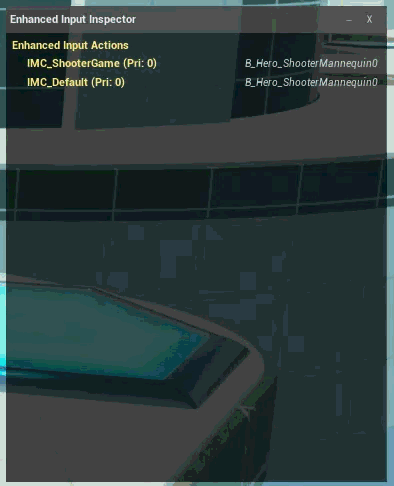
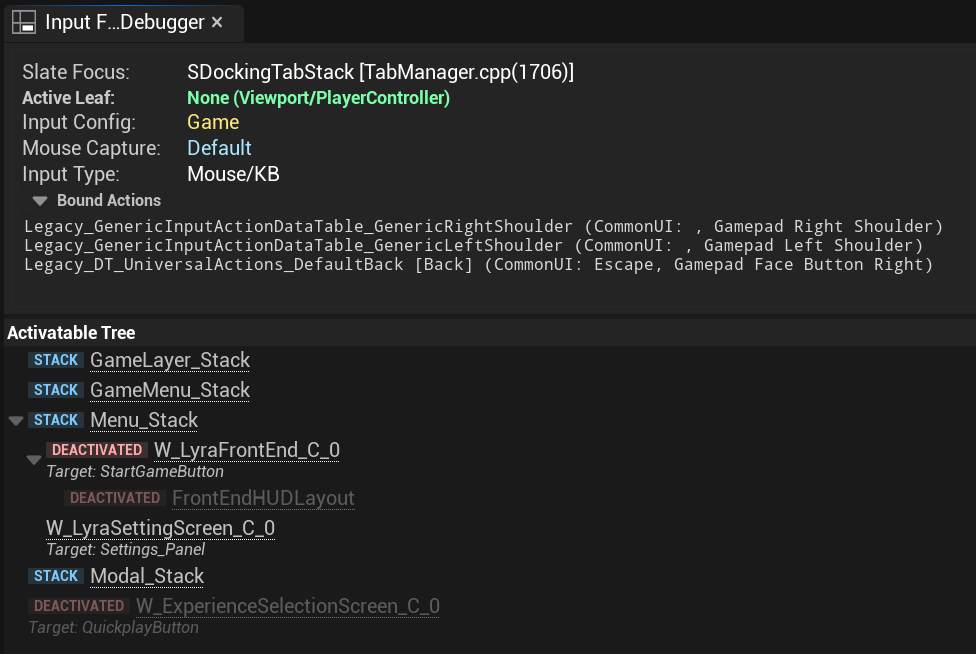
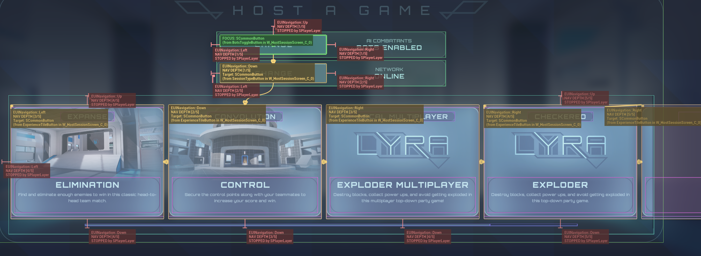
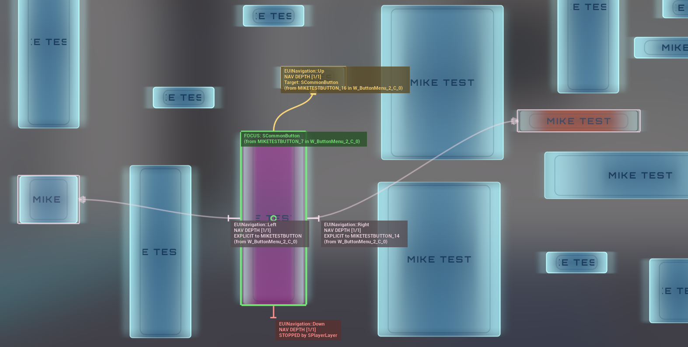
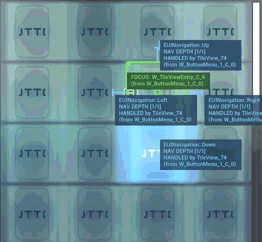

# Input Flow Debugger

Unreal UI has many layers of input routing and focus management that can be difficult to visualize and debug. This plugin provides an in-game overlay and editor tools to help developers understand and troubleshoot input flow, navigation, and focus behavior in Unreal Engine 5 projects.

This is intended to be a tool in the toolbox in addition to the WidgetReflector and other built-in debugging tools.

## Dependencies

* Created based on vanilla **Unreal Engine 5.6**, compatibility with other versions is not guaranteed. Pull requests for other versions are welcome.
* **Enhanced Input** (Optional, but required for Enhanced Input inspection features)
* **CommonUI** (Optional, but required for **ActivatableWidget** hierarchy features)

## Features

* **Navigation Simulation ("Nav Spider"):** Visualizes where navigation input (D-Pad/Arrow Keys) will go next, identifying explicit rules, boundary stops, and wrap behavior.
* **Visual Focus History:** Track widget focus changes over time with a visual trail on screen.
* **Input Event Logging:** Real-time log of Slate input events (Key Down, Click, Hover, Focus) with rich text links to open the specific widget asset in the Editor.
* **Enhanced Input Inspector:** Live view of active Contexts, Actions, Trigger states, and Modifiers.
* **CommonUI Integration:** Visualizes the Activatable Widget stack/queue and identifies the current Input Routing Leaf.
* **Draggable Overlay:** In-game debug overlay with movable, resizable panels.
* **Editor Dock Tab:** Analyze input state without cluttering the game viewport using the dedicated Editor Tab.

## Installation

1.  Copy the `InputFlowDebugger` folder into your project's `Plugins` directory.
2.  Regenerate project files and compile.
3.  Enable the plugin in **Edit > Plugins**.

## Usage

### In-Game Overlay
The debugger injects an overlay directly into the game viewport.
* **Toggle Overlay:** Use the console command `InputFlow.Overlay 1` to enable and `InputFlow.Overlay 0` to disable.

### Editor Analyzer
For a static view or secondary monitor debugging:
1.  Go to **Tools > Debug > Input Flow Debugger**.
2.  Play in Editor (PIE) to populate the data.

## Visual Guide

### Navigation Simulation
The debugger draws splines indicating navigation flow:
* **Orange:** Normal navigation.
* **Pink:** Explicit navigation rule.
* **Red:** Navigation stop.
* **Blue:** Handled by container.

## License
MIT License. Pull requests and contributions are welcome!
